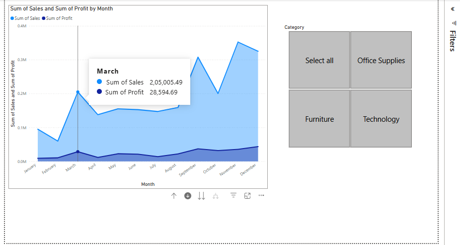

# PowerBI

## 📊 some Visualizations

### 🔹 Area Chart

### 🔹 Clustered & Stacked Charts

### 🔹 Line Charts

### 🔹 Line - Stacked & Clustered

### 🔹 Stacked Area Chart

Power BI: Key Uses &amp; Benefits 🚀 Power BI is a powerful business intelligence tool by Microsoft used for data analysis and visualization. 
Here are some of its key uses:  
🔹 1. Data Visualization & Dashboards 
Create interactive reports and dashboards with dynamic visuals. 

Use charts, graphs, and maps to analyze trends & insights. 

🔹 2. Data Integration & Connectivity 
Connect with multiple data sources: Excel, SQL, APIs, Cloud services (Azure, Google Analytics, etc.). 

Merge and transform data easily with Power Query. 

🔹 3. Real-time Data Monitoring 
Connect to live data sources for real-time updates. 

Set up alerts and notifications based on key business metrics. 

🔹 4. Advanced Data Modeling 
Use DAX (Data Analysis Expressions) for calculations & aggregations. 

Define relationships between tables and create measures & calculated columns. 

🔹 5. Business & Decision-Making Support 
Helps businesses track KPIs, revenue, sales trends, customer behavior, etc. 

Enables data-driven decisions with better accuracy. 

🔹 6. Power BI Service (Cloud-based sharing) 
Publish reports to Power BI Service and share with teams. 

Access reports from web, mobile, or Power BI Desktop. 

🔹 7. AI & Machine Learning Features 
Use AI-powered insights, forecasting, anomaly detection, etc. 

Integrate with Python & R for advanced analytics. 
